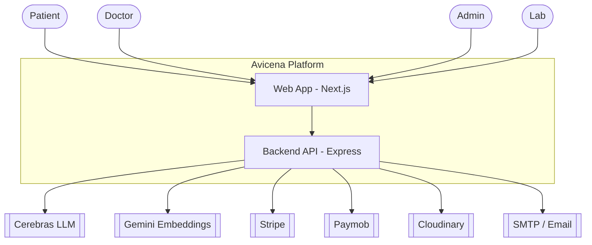
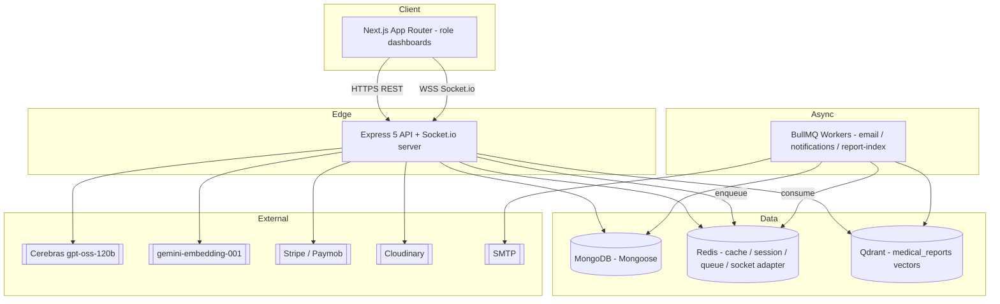
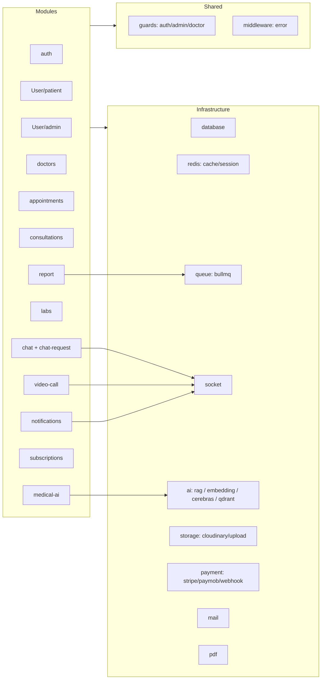
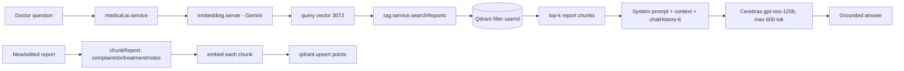
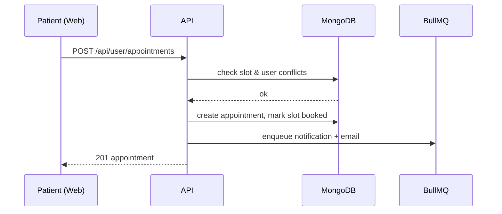
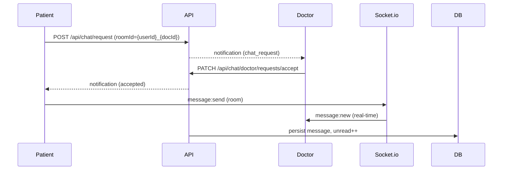
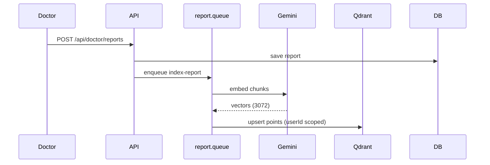

# 3. System Architecture

Views follow the **C4 model**: Context → Container → Component → Deployment, plus key data-flow sequences. Diagrams are Mermaid.

---

## 3.1 Context (C1)



---

## 3.2 Container (C2)



**Startup order** (`server.js`): `connectRedis()` → `connectDB()` → `startEmailWorker()` → `initQdrant()` → `server.listen()`. Socket.io is initialized on the HTTP server before listen.

---

## 3.3 Component (C3) — Backend module layout

The backend is organized **domain-first**. Each module owns a vertical slice:

```
modules/<domain>/
  <domain>.routes.js       # HTTP surface, guard wiring
  <domain>.controller.js   # request/response, no business logic
  <domain>.service.js      # business rules / orchestration
  <domain>.repository.js   # data access (Mongoose)
  <domain>.model.js        # schema
  <domain>.validation.js   # zod schemas (where present)
  <domain>.socket.js       # realtime handlers (chat/video/notifications)
```



### Layering rules
- **Controllers** never touch Mongoose directly — only services.
- **Services** hold business rules; call repositories + infrastructure.
- **Repositories** are the only place with model queries.
- **Infrastructure** is domain-agnostic and reusable.
- **Guards** (`auth.guard`, `admin.guard`, `doctor.guard`) enforce role + token-header per route.

---

## 3.4 Medical AI (RAG) component detail



Vector isolation: every point carries `userId`, `docId`, `reportId`, `section`; retrieval filters `must userId == patient`. Deletions filter by `userId` or `reportId`.

---

## 3.5 Deployment (C4)

```mermaid
graph TB
  subgraph CDN
    Vercel[Next.js on Vercel/Node host]
  end
  subgraph AppTier["App Tier (containers)"]
    API1[API instance 1]
    API2[API instance N]
    W1[Worker 1..N]
  end
  subgraph Managed
    MongoAtlas[(MongoDB Atlas)]
    RedisMgd[(Managed Redis)]
    QdrantMgd[(Qdrant Cloud/self-host)]
  end
  Users((Users)) --> Vercel --> LB[Load Balancer] --> API1
  LB --> API2
  API1 --> RedisMgd
  API2 --> RedisMgd
  W1 --> RedisMgd
  API1 --> MongoAtlas
  API1 --> QdrantMgd
  RedisMgd -. socket.io adapter .- API1
  RedisMgd -. socket.io adapter .- API2
```

- **Stateless API** instances behind an LB; sticky sessions **not** required if the Socket.io Redis adapter is enabled.
- **Workers** scale independently of the API.
- Managed data services with backups/replication.

---

## 3.6 Key runtime data flows

**Booking**


**Chat request → accept → message**


**Report indexing (AI)**

