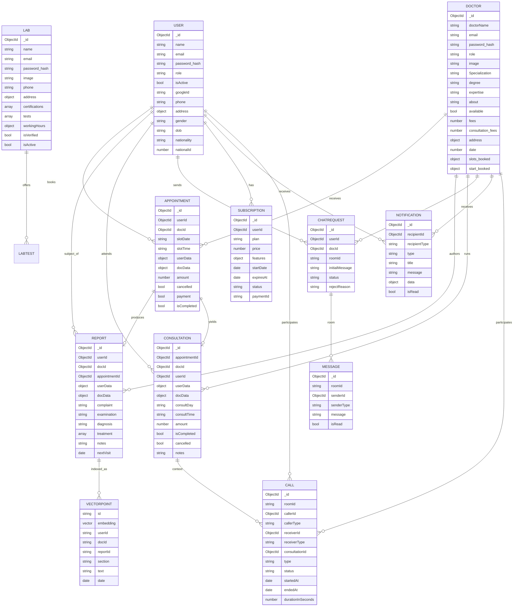

# 4. Database Design

**Primary store:** MongoDB (Mongoose 9). **Vector store:** Qdrant (`medical_reports`). **Ephemeral:** Redis (cache, sessions, BullMQ, socket presence).

> Schemas below reflect the actual Mongoose models in `Backend/src/modules/*/*.model.js`.

---

## 4.1 ERD (logical)

---

## 4.2 Collections & schemas

### `users`
| Field | Type | Notes |
|-------|------|-------|
| name | String | required |
| email | String | **unique** |
| password | String | `select:false`; required unless `googleId` |
| role | enum(`admin`,`patient`) | default `patient` |
| isActive | Boolean | default true |
| googleId | String | OAuth link |
| image | String | base64 default avatar |
| address | Object | `{line1,line2}` |
| gender/dob/phone/nationality | String | defaults present |
| nationalId | Number | **unique, sparse** |
| timestamps | — | createdAt/updatedAt |

### `doctors`
Key fields: `doctorName`, `email` (unique), `password` (`select:false`), `role` enum(`doctor`,`lab`), `image` (req), `Specialization`, `degree`, `expertise`, `about`, `available`, `fees`, `consultation_fees`, `address` (obj), `date` (Number), `slots_booked` (Object map), `start_booked{from,to,booking_period}`. `minimize:false` so empty objects persist.

### `appointments`
`userId→User`, `docId→Doctor`, `slotDate` (String e.g. `20_1_2026`), `slotTime` (String e.g. `10:00 am`), denormalized `userData`/`docData`, `amount`, flags `cancelled`/`payment`/`isCompleted`, timestamps.

### `report` (model name `report`)
`userId`, `docId`, `appointmentId`, denormalized `userData`/`docData`, `complaint`, `examination`, `diagnosis`, `treatment[]{name,dosage,duration}`, `notes`, `nextVisit` (Date), timestamps.

### `consultations`
`appointmentId` + `appointmentData`, `docId`, `userId`, `userData`, `docData`, `consultDay` (String), `consultTime` (String), `amount`, `isCompleted`, `cancelled`, `notes`.

### `chatrequests`
`userId`, `docId`, `roomId` (String `{userId}_{docId}`), `initialMessage` (≤500), `status` enum(`pending`,`accepted`,`rejected`), `rejectReason`. Indexes below.

### `chat` (messages)
`roomId` (indexed), `senderId`, `senderType` enum(`user`,`doctor`), `message`, `isRead`, timestamps.

### `subscription`
`userId` (indexed), `plan` enum(`free`,`basic`,`premium`), `price`, `features{maxConsultationsPerMonth,videoCallEnabled,chatEnabled,prioritySupport}`, `startDate`, `expiresAt`, `status` enum(`active`,`expired`,`cancelled`), `paymentId`.

### `notification`
`recipientId`, `recipientType` enum(`user`,`doctor`,`admin`,`lab`), `type` enum(`appointment`,`consultation`,`report`,`system`,`payment`,`chat`,`chat_request`), `title`, `message`, `data` (Object), `isRead`.

### `Call`
`roomId` (indexed), `callerId/Type`, `receiverId/Type`, `consultationId`, `type` enum(`video`,`audio`), `status` enum(`ringing`,`ongoing`,`ended`,`missed`,`rejected`), `startedAt`, `endedAt`, `durationInSeconds`.

### `labs`
`name`, `email` (unique, lowercase), `password` (`select:false`), `image`, `phone`, `address{line1(req),line2,city}`, `certifications[]`, `tests[]{name,price,duration,description}`, `workingHours{from,to}`, `isVerified`, `isActive`.

### Qdrant `medical_reports`
- **Vector size:** 3072, **distance:** Cosine.
- **Payload:** `userId`, `docId`, `reportId`, `section` (`complaint_examination`|`diagnosis`|`treatment`|`notes`), `text`, `date`.
- One report → up to 4 points (chunks). Retrieval filters `userId`.

---

## 4.3 Index strategy

| Collection | Index | Rationale |
|-----------|-------|-----------|
| users | `email` unique | login/lookup |
| users | `nationalId` unique sparse | national-id uniqueness w/o forcing presence |
| doctors | `email` unique | login |
| labs | `email` unique | login |
| chatrequests | `{roomId:1, createdAt:-1}` | room history ordering |
| chatrequests | `{docId:1, status:1}` | doctor pending-request queue |
| chatrequests | `{userId:1}` | patient's requests |
| chat | `roomId` | message fetch by room |
| subscription | `{userId:1, status:1}` | active-sub lookup |
| notification | `{recipientId:1, isRead:1}` | feed + unread count |
| Call | `roomId` | call session lookup |
| Qdrant | payload `userId` (filter) | per-patient isolation |

**Recommended additions** (`infrastructure/database/indexes.js` is the place):
- `appointments`: `{userId:1, slotDate:1}`, `{docId:1, slotDate:1}`, `{isCompleted:1, cancelled:1}`.
- `report`: `{userId:1, createdAt:-1}`, `{docId:1, createdAt:-1}`, `{appointmentId:1}`.
- `consultations`: `{userId:1}`, `{docId:1}`, `{appointmentId:1}`.
- Qdrant: create a **payload index** on `userId` and `reportId` for fast filtered search/delete.

---

## 4.4 Data lifecycle & integrity notes
- **Denormalization:** appointments/reports/consultations embed `userData`/`docData` snapshots — fast reads, but must be refreshed on profile change if display consistency matters.
- **Cascade on delete:** deleting a report → delete its Qdrant vectors (`deleteReportVectors`); deleting/deactivating a user → `deleteUserVectors`.
- **Slot bookkeeping:** `doctors.slots_booked` is an Object map keyed by date; "Clear Slots" resets it. Consider TTL cleanup of past slots.
- **Referential integrity** is application-enforced (Mongo has no FKs) — keep it in services/repositories.
- **PHI retention:** define a retention/erasure policy for reports + vectors (see Security Design).
