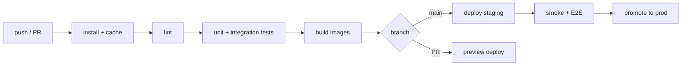

# 7. DevOps Design

Covers repository structure (backend + planned Next.js frontend), environment config, CI/CD, Makefile, containerization, and deployment.

---

## 7.1 Repository structure (monorepo)

```
avicena-platform/
├── Backend/                     # Express API (implemented)
│   ├── app.js                   # express app + route mounting
│   ├── server.js                # boot: redis → mongo → workers → qdrant → listen
│   ├── package.json
│   └── src/
│       ├── config/              # cloudinary, db, redis, socket
│       ├── infrastructure/      # ai, database, mail, payment, pdf, queue, redis, socket, storage
│       ├── modules/             # domain slices (auth, doctors, appointments, …, medical-ai)
│       └── shared/              # guards, middleware
├── Frontend/                    # Next.js App Router (planned — scaffolded here)
│   ├── package.json
│   ├── next.config.ts
│   ├── tsconfig.json
│   ├── tailwind.config.ts
│   ├── .env.example
│   └── src/
│       ├── app/                 # routes (route groups per role)
│       ├── components/          # ui + shared
│       ├── features/            # per-domain UI + data hooks
│       ├── lib/                 # api (axios), auth, socket
│       ├── hooks/ store/ types/ config/
├── artifacts/                   # this documentation set
├── docker-compose.yml           # local infra (mongo, redis, qdrant) + api + web
├── Makefile
└── .github/workflows/ci.yml
```

### Frontend route layout (role-based, single app)
```
src/app/
├── layout.tsx                  # root providers (theme, query, socket, auth)
├── page.tsx                    # public landing
├── (public)/doctors/           # public doctor listing (SSR/SEO)
├── (auth)/
│   ├── login/                  # unified login (detects role)
│   └── register/
├── (patient)/patient/
│   ├── layout.tsx              # PatientLayout (guarded: role=patient)
│   ├── dashboard/ appointments/ consultations/ reports/ chat/ subscriptions/ profile/
├── (doctor)/doctor/
│   ├── layout.tsx              # DoctorLayout (guarded: role=doctor)
│   ├── dashboard/ appointments/ patients/ reports/ consultations/
│   └── chat/                   # chat + Medical-AI side panel
├── (admin)/admin/
│   ├── layout.tsx              # AdminLayout (guarded: role=admin)
│   └── dashboard/ doctors/ users/ appointments/ consultations/ reports/ labs/
└── (lab)/lab/
    ├── layout.tsx              # LabLayout (guarded: role=lab)
    └── profile/ tests/
```
Rationale (see conversation): **one app, one domain, role-based route groups** — shared realtime/notification code, one design system, one deploy. Auth interceptor injects the correct header (`Authorization`/`dtoken`/`atoken`/`ltoken`) based on the stored role.

---

## 7.2 Environment configuration

`Backend/.env`
```
NODE_ENV=development
PORT=4000
MONGO_URI=mongodb://localhost:27017/avicena
REDIS_URL=redis://localhost:6379
QDRANT_URL=http://localhost:6333
JWT_ACCESS_SECRET=...
JWT_REFRESH_SECRET=...
CEREBRAS_API_KEY=...
GEMINI_API_KEY=...
CLOUDINARY_CLOUD_NAME=... CLOUDINARY_API_KEY=... CLOUDINARY_API_SECRET=...
STRIPE_SECRET_KEY=... STRIPE_WEBHOOK_SECRET=...
PAYMOB_API_KEY=...
SMTP_HOST=... SMTP_PORT=... SMTP_USER=... SMTP_PASS=...
CLIENT_ORIGIN=http://localhost:3000
```

`Frontend/.env` (only `NEXT_PUBLIC_*` reaches the browser — **never** put API keys here)
```
NEXT_PUBLIC_API_URL=http://localhost:4000
NEXT_PUBLIC_SOCKET_URL=http://localhost:4000
```

---

## 7.3 Containerization

`docker-compose.yml` (local dev)
```yaml
services:
  mongo:    { image: mongo:7,        ports: ["27017:27017"], volumes: ["mongo:/data/db"] }
  redis:    { image: redis:7-alpine, ports: ["6379:6379"] }
  qdrant:   { image: qdrant/qdrant,  ports: ["6333:6333"], volumes: ["qdrant:/qdrant/storage"] }
  api:
    build: ./Backend
    env_file: ./Backend/.env
    ports: ["4000:4000"]
    depends_on: [mongo, redis, qdrant]
  web:
    build: ./Frontend
    env_file: ./Frontend/.env
    ports: ["3000:3000"]
    depends_on: [api]
volumes: { mongo: {}, qdrant: {} }
```

`Backend/Dockerfile` (multi-stage, prod)
```dockerfile
FROM node:20-alpine AS deps
WORKDIR /app
COPY package*.json ./
RUN npm ci --omit=dev
FROM node:20-alpine
WORKDIR /app
COPY --from=deps /app/node_modules ./node_modules
COPY . .
EXPOSE 4000
CMD ["node", "server.js"]
```

> The API process and the **BullMQ workers** can run as the same image with different start commands, or split into separate deployments for independent scaling.

---

## 7.4 Makefile

```makefile
.PHONY: up down logs api web seed lint test index-reports

up:            ## start local infra + apps
	docker compose up -d --build

down:
	docker compose down

logs:
	docker compose logs -f api web

api:           ## run backend in watch mode
	cd Backend && npm run dev

web:           ## run frontend in dev mode
	cd Frontend && npm run dev

seed:          ## seed database
	cd Backend && npm run seed

lint:
	cd Backend && npx eslint . && cd ../Frontend && npm run lint

test:
	cd Backend && npm test && cd ../Frontend && npm test

index-reports: ## backfill Qdrant vectors for existing reports
	cd Backend && node src/scripts/reindex.js
```

---

## 7.5 CI/CD (GitHub Actions)



**Pipeline stages**
1. **Install** (npm ci, cache node_modules).
2. **Lint** (eslint + prettier check) — backend & frontend.
3. **Test** — unit + integration (spin up mongo/redis/qdrant as services).
4. **Build** — Docker images (api, worker, web) tagged by SHA.
5. **Security** — `npm audit`, secret scan.
6. **Deploy** — staging on `main`; prod on tag/manual approval. Frontend → Vercel/Node host; API+workers → container platform.
7. **Post-deploy** — health checks (`GET /`), smoke E2E, migrations/index sync.

**Branching:** trunk-based with short-lived feature branches; PR requires green CI + review. Conventional commits (already used, e.g. `feat(rag): …`).

---

## 7.6 Observability & ops
- **Health:** `GET /` returns `{status:"ok"}`. Add `/healthz` (DB/Redis/Qdrant probes) for orchestrators.
- **Logs:** Morgan `combined` in prod → shipped to a log aggregator.
- **Metrics:** request latency/error rate, queue depth, AI latency/error, socket connections.
- **Backups:** MongoDB PITR; Qdrant snapshots; Redis persistence for queues.
- **Rollback:** immutable image tags; keep N-1 deployable.

## 7.7 Scaling posture
- API is stateless → scale horizontally behind an LB.
- Socket.io → enable **Redis adapter** for multi-instance rooms.
- Workers scale by queue depth independently of API.
- Data tiers managed/replicated (Atlas, managed Redis, Qdrant Cloud).
