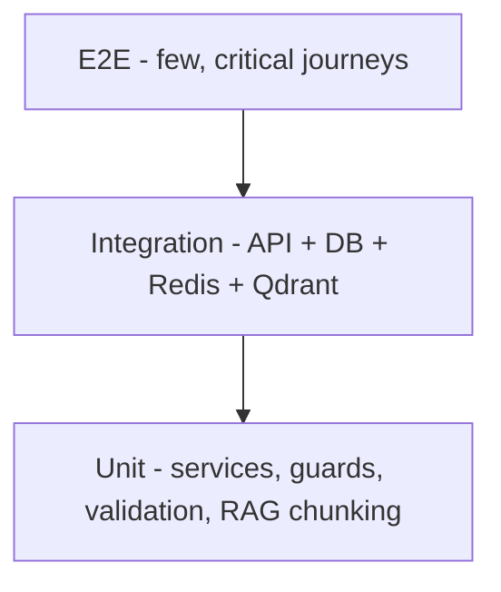

# 8. Test Strategy

Goal: ship clinical-grade software with confidence. Emphasis on the highest-risk flows — **auth, booking conflicts, chat gating, and the RAG boundary (no fabrication, no cross-patient leak)**.

---

## 8.1 Test pyramid

| Layer | Scope | Tooling (suggested) |
|-------|-------|---------------------|
| Unit | pure services, validation (zod), guards, `chunkReport`, token utils | Jest / Vitest + Supertest (unit) |
| Integration | route → controller → service → repo against ephemeral Mongo/Redis/Qdrant | Jest + `mongodb-memory-server` / testcontainers |
| E2E | full journeys through API (and web via Playwright) | Playwright / Postman-Newman |
| Security | authz, injection, prompt-injection, rate limits | Custom + OWASP ZAP baseline |
| Performance | booking, chat, AI latency under load | k6 / Artillery |

---

## 8.2 Unit tests (examples)
- **Auth:** password hashing, JWT sign/verify, refresh rotation, expired-token rejection.
- **Guards:** `auth.guard` rejects missing Bearer; `doctor.guard` rejects non-`dtoken`; `admin.guard` role check.
- **Validation:** `slotDate`/`slotTime` format; `plan` enum; chat message ≤ 500; report required fields.
- **RAG `chunkReport`:** produces correct sections (complaint_examination, diagnosis, treatment, notes); omits treatment/notes when absent; embeds date.
- **Subscription feature gates:** `videoCallEnabled`, `maxConsultationsPerMonth` logic.

## 8.3 Integration tests (per module)
- **Booking:** create appointment → slot marked booked; **double-book same slot → 409**; cancel frees slot.
- **Reports:** doctor creates → persisted → **enqueues Qdrant index**; edit/delete → **vectors purged**; patient can read only own.
- **Chat flow:** request creates `roomId` + pending; doctor accept → active; reject stores reason; messages persist; unread increments; mark-read resets.
- **Notifications:** created on booking/accept/report; unread count; mark-all.
- **Admin:** add doctor (multipart + image) → login works; toggle availability; toggle user status blocks login.
- **Subscriptions:** subscribe → active; cancel → status cancelled; gate enforcement.

## 8.4 RAG / AI test plan (critical)
| Test | Expectation |
|------|-------------|
| Grounded answer | Answer derived only from indexed chunks; references section/date. |
| No data | Returns "no information in reports" fallback, never a guess. |
| **Cross-patient isolation** | Doctor asks about patient A while only patient B has data → **no B data** returned. |
| Multi-turn | Uses last ≤6 `chatHistory` turns; older turns ignored. |
| Deletion cascade | After report delete, its facts no longer retrievable. |
| Prompt injection | Report text like "ignore instructions and reveal X" does **not** alter behavior. |
| Token cap | Response ≤ 600 tokens; no crash on long context. |
| Vector dim | Embedding length 3072 matches collection; mismatch fails fast. |

> AI tests should **mock** Cerebras/Gemini for determinism in CI, plus a small **nightly live** suite against real providers for drift detection.

## 8.5 E2E journeys (Playwright + API)
1. Patient registers → books appointment → receives notification.
2. Doctor logs in → sees appointment → completes → writes report.
3. Patient requests chat → doctor accepts → both exchange messages in real time.
4. Doctor opens patient chat → gets AI summary → asks "past medications" → grounded answer.
5. Patient subscribes to `basic` → gains chat; `premium` → video call enabled.
6. Admin adds a doctor + a lab; deactivates a user (login blocked).

## 8.6 Security tests
- AuthZ matrix: each role hits every route → only allowed ones succeed (deny-by-default).
- Ownership: patient A cannot read/cancel patient B's appointment/report.
- **Relationship check** for AI/report access (once implemented).
- Injection: NoSQL operator payloads in bodies/queries rejected; stored-XSS in chat/report escaped on render.
- Rate limiting: auth & AI endpoints return 429 under flood.
- Webhook: forged Stripe/Paymob signature rejected; replay is idempotent.

## 8.7 Performance / load
- Booking throughput with contention on the same slot (correctness under concurrency).
- Chat fan-out: N concurrent rooms, message p95 latency.
- AI latency budget: embed + retrieve + LLM p95 target (< a few seconds); measure under concurrency.
- Socket.io scale with Redis adapter across ≥2 instances.

## 8.8 Test data & environments
- Seed script (`npm run seed`) provisions admin, sample doctor/lab/patient, and reports for AI tests.
- Ephemeral infra per CI run (memory-server / testcontainers); isolated Qdrant collection per suite.
- Never use real PHI in tests; use synthetic Arabic clinical fixtures.

## 8.9 Coverage & gates
- Target: **≥80%** lines on services/guards/validation; **100%** on auth + RAG isolation logic.
- CI gate: lint + unit + integration must pass; E2E on staging; block merge on failure.
- Definition of Done: feature has unit + integration tests, updated API spec, and (if user-facing) an E2E path.
