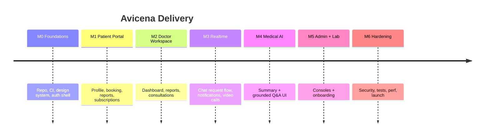
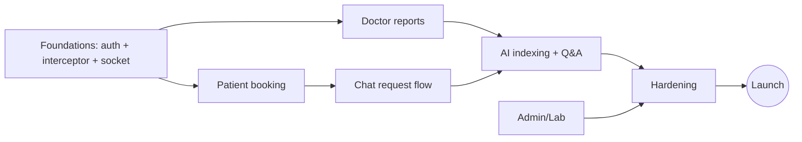

# 9. Execution Plan

Focus: the backend is largely implemented; this plan drives the **Next.js frontend** to parity and hardens the platform for production. Estimates are in ideal engineer-days for a small team (2 FE, 1 BE, shared QA).

---

## 9.1 Milestones

---

## 9.2 Epics → Features

### EPIC 0 — Foundations (M0)
| Feature | Est (d) |
|---------|---------|
| Next.js App Router scaffold + TS + Tailwind + UI kit | 2 |
| Axios instance + role-aware auth interceptor (`Bearer`/`dtoken`/`atoken`/`ltoken`) | 2 |
| Auth store (role+token), ProtectedRoute per route group | 2 |
| Unified login/register + refresh-token flow | 3 |
| Socket.io client provider + reconnect | 2 |
| CI/CD, docker-compose, env wiring | 2 |

### EPIC 1 — Patient Portal (M1)
| Feature | Est (d) |
|---------|---------|
| Public doctor listing (SSR) + doctor profile | 3 |
| Profile view/edit (multipart image) | 2 |
| Appointment booking (slot picker) + conflict handling | 4 |
| My appointments (paginated) + cancel | 2 |
| My reports viewer (+ PDF) | 3 |
| Consultations: list/single/reschedule/cancel | 3 |
| Subscriptions: plans, subscribe, active, cancel + payment | 4 |

### EPIC 2 — Doctor Workspace (M2)
| Feature | Est (d) |
|---------|---------|
| Doctor dashboard (KPIs) | 3 |
| Profile + availability/working window editor | 2 |
| Appointments: list/complete/cancel | 2 |
| Report editor (CRUD, treatment rows) | 4 |
| Patient search + per-patient stats + reports | 3 |
| Consultations: create/list/complete/cancel | 3 |

### EPIC 3 — Realtime (M3)
| Feature | Est (d) |
|---------|---------|
| Chat request UX (patient send / doctor accept-reject) | 3 |
| Chat room (history pagination, unread, read receipts, typing) | 5 |
| Notification center (feed, unread, mark-read, live push) | 3 |
| Video call (WebRTC/simple-peer UI, history) | 5 |

### EPIC 4 — Medical AI (M4)
| Feature | Est (d) |
|---------|---------|
| Auto patient-summary panel on chat open | 2 |
| Grounded Q&A chat UI (chatHistory, citations, "unavailable" state) | 4 |
| Report → index trigger + reindex/backfill script | 2 |
| Relationship guard (doctor↔patient) before AI/report access | 2 |

### EPIC 5 — Admin + Lab (M5)
| Feature | Est (d) |
|---------|---------|
| Admin dashboard + doctors CRUD (image) | 3 |
| Users: list/search/toggle status | 2 |
| Global appointments/consultations/reports management | 3 |
| Lab onboarding (admin) + lab self-profile + test catalog | 3 |

### EPIC 6 — Hardening & Launch (M6)
| Feature | Est (d) |
|---------|---------|
| Security backlog (audit log, unified auth, prompt-injection, rate limits) | 5 |
| DB + Qdrant payload indexes | 1 |
| Test suites to coverage gates (unit/integration/E2E/security) | 6 |
| Performance/load + Socket.io Redis adapter | 3 |
| Observability (healthz, metrics, alerts) | 2 |
| RTL/i18n polish + accessibility pass | 3 |

---

## 9.3 Critical path

**Longest chain:** Foundations → Doctor reports → AI indexing/Q&A → Hardening → Launch. The auth interceptor and reports module are the two upstream dependencies that unblock the most work — build them first.

---

## 9.4 Rough timeline & effort

| Milestone | Scope | Team-weeks (2–3 devs) |
|-----------|-------|------------------------|
| M0 Foundations | ~13 d | ~1.5 |
| M1 Patient | ~21 d | ~2.5 |
| M2 Doctor | ~17 d | ~2 |
| M3 Realtime | ~16 d | ~2 |
| M4 Medical AI | ~10 d | ~1.5 |
| M5 Admin/Lab | ~11 d | ~1.5 |
| M6 Hardening | ~20 d | ~2.5 |
| **Total** | ~108 ideal-days | **~13–14 weeks** |

(Sequential calendar assumes overlap between FE tracks; parallelizing patient/doctor tracks shortens wall-clock.)

---

## 9.5 Resourcing
- **2 Frontend** engineers (split patient vs doctor/admin tracks).
- **1 Backend** engineer (security backlog, AI relationship guard, indexes, webhooks, socket adapter).
- **Shared QA/automation** (Playwright + integration harness) from M1 onward.
- **Part-time DevOps** for CI/CD, infra, observability.

## 9.6 Risks to the plan
- AI provider latency/cost variability → mock in CI, budget monitoring, caching summaries.
- Payment integration edge cases (Stripe + Paymob) → allocate buffer in M1.
- Real-time scale surprises → schedule Redis-adapter + load test early in M3, not M6.
- Auth-header unification is cross-cutting → do it during M0 to avoid rework.

## 9.7 Definition of Done (per feature)
Code + tests (unit/integration, E2E if user-facing) + updated API spec + a11y/RTL check + reviewed PR + green CI + deployed to staging.
